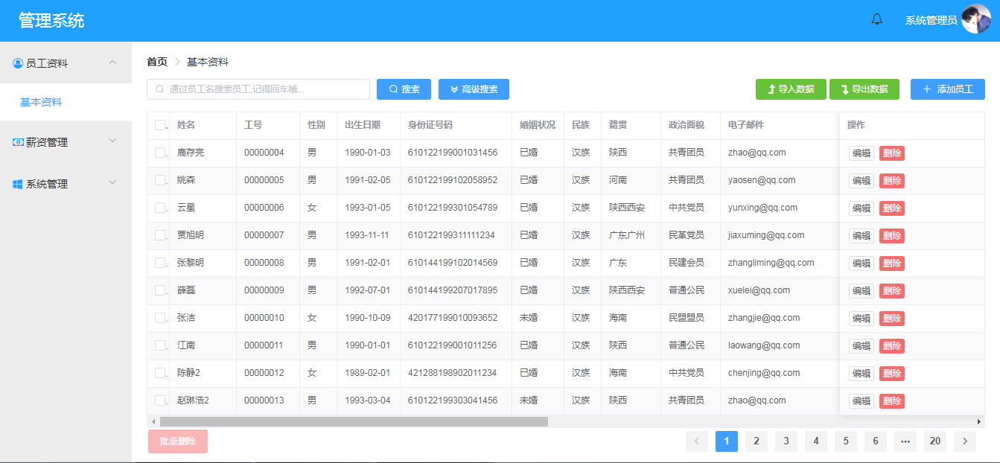

## 项目简介
这是一个前后端分离的简单实现人事管理系统的小项目，项目采用SpringBoot+Vue+ElementUI开发。

配套前端：[https://github.com/allen512/hr-manage-client](https://github.com/allen512/hr-manage-client)

登录账户：admin
密码：Aa1234

## 后端技术栈

1.SpringBoot  
2.SpringSecurity  
3.MyBatis  
4.MySQL  

## 前端技术栈

1.Vue  
2.ElementUI  
3.axios  
4.vue-router  

###项目截图
